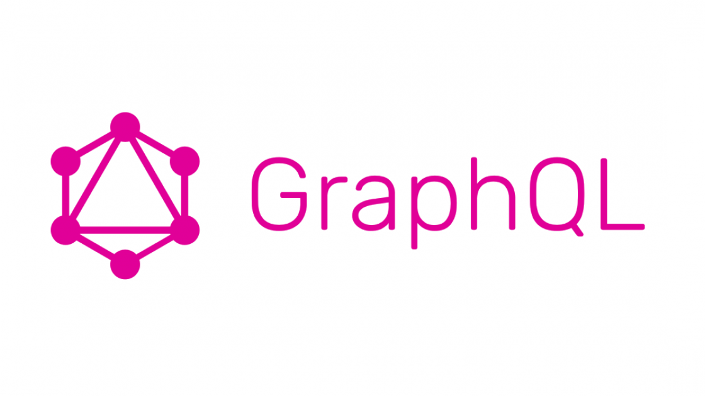

GraphQL은 <strong>How to ask flexibly for data to server?</strong> 라는 의문에서 시작되었다.
이러한 의문에서 시작 했기 때문에 query라는 것이 등장하였고, flexibly를 위해서 REST API와 같이 database와 플랫폼에 종속되지 않는 특징을 지니고 있다. 
이 포스트에서는 어떠한 경우에 GraphQL을 사용하며, 기존에 주로 사용되던 REST와 어떠한 차이점이 있는지 개념과 함께 정리한다.

## GraphQL?
GraphQL은 2012년에 Facebook이 개발하여 2015년에 공개적으로 발표한 data query이다. 현재(2019년 11월) 기준으로 GraphQL은 아직 early stage이다.
실제로 국내에서 얼마나 많은 API가 GraphQL API로 OPEN되어있는지..... 찾기도 어렵다.(아마 거의 없을 듯....) 해외의 경우도 [Github](https://developer.github.com/v4/)에서는 사용 한다고 하지만, 그 외에도 사용하는 곳은 매우 드물다. 
그럼에도 불구하고 전 세계적으로 GraphQL에 대한 관심이 매우 가파르게 올라가고있으며, 이를 도입하기 위한 노력도 계속되고 있다.
실제로 google에 GraphQL을 검색하면 벌써 sample project가 올라와 있다.(심지어 한국어로 설명된 sample project도 은근히 있다.) 그러면 왜 이렇게 GraphQL에 대한 관심이 늘어나고 있는 것 인가?

GraphQL은 다양한 언어로 구현되어있는 API들을 위한 data query이다. 현재 구현되어 있는 언어는 client는 apollo client, relay 등이 있고, 서버는 JavaScripts, Python, ruby, JAVA, C#, scala, go, PHP 등등... 현재 web service를 위해서 사용하는 대부분의 언어로 구현되어있다.
앞서, query라는 점에서 SQL과 GraphQL이 상당히 유사하다고 언급하였다. 이는 단순히 query라는 관점에서 유사하다는 것 이고, 실제로 이를 사용하는 관점에서의 구조와 방식에서는 상당한 차이를 보인다.
이러한 차이는 SQL은 database에서 정보를 가져오기 위한 목적으로 탄생한 query이고, GraphQL은 web client가 server로 부터 data를 가져오기 위한 목적이기 때문에 고려해야 하는 점이 다르다.
 
~~~SQL
SELECT TITLE, BODY, DATE, DOCID FROM COLLECTION;
~~~
> collection table에서 title, body, date, docid 값을 가져오는 SQL 예시
~~~
{
    document {
        TITLE
        BODY
        DATE
        DOCID
    }
}
~~~
> document라는 struct에 title, body, date, docid를 담아서 data를 가져오기 위한 GraphQL 예시

 
server side에서는 client로 부터 받은 GraphQL로 작성된 query를 받아서 처리한 다음에 이를 다시 client로 돌려준다. 
이때, HTTP API 자체가 특정 Database나 플랫폼에 종속 되어있지 않기 때문에 GraphQL역시 이것들에 종속되어있지 않다. 심지어 network 방식에도 종속되어 있지 않다고 한다.

## REST API와의 차이점
위에서 설명한 GraphQL을 보다보면 이젠 SQL이 아닌 REST API가 떠오르게 된다. REST API의 가장 큰 특징은 URL, METHOD를 조합해서 사용하고 그로 인해서 endpoint가 다양하게 존재한다는 점 이다.
그래서 request하는 url을 게속해서 만들어 줘야하고, 변경이 일어나면 매우 불편하다는 단점을 가지고 있다. 반면, GraphQL API의 경우에는 endpoint에 따라서 달라지는 것이 아니라 schema에 따라서 달라진다. 
예를들어, 피자집과 잡화점 그리고 세탁소에 대해 요청을 해야한다면, REST API는 각각 모두에 대한 전화번호를 알고선 해당 전화 번호로 전화를 걸어서 요구해야 한다. 모두 endpoint가 다르다.

반면 GraphQL의 경우에는 client는 오로지 하나의 endpoint만을 가지며, 여기에 필요한 내용을 query로 요청하면 그에 맞는 정보를 돌려준다. endpoint를 각각 따로 관리하고 요청할 필요가 없다.

그래서 REST API와 다르게 한번의 네트워크 호출로 여러 정보를 얻어 올 수 있다. 이를 가능하게 하기 위해서 GraphQL API는 <strong>schema, queries, resolvers</strong>으로 구성되어있다.

##GraphQL API 구조
### 1. Schema / Type
Schema란 GraphQL에서 data를 표현하는 방법이다. 사실 다른 곳 에서 사용하는 schema라는 개념과 큰 차이가 없다.
앞서 설명 한 것 처럼, GraphQL API는 endpoint가 하나이다. 그러다 보니 server에 요청할 수 있는 정확한 데이터 표현이 필요하다. 
그리고 어떤 필드를 선택할 수 있는지, 어떤 종류의 객체를 반활할 수 있는지 등 필요한 것들이 존재하는데, 이러한 것을 가능하게 해주기 위해서 schema가 필요하다.
모든 GraphQL service는 data들에 대한 완벽한 정의와 설명이 필요하고, 실제 수행 할 때, query가 들어오면 해당 schema에 대해 유효성 검사를 진행 한 후 실행된다.
GraphQL에서 schema 작성은 C/C++의 header를 작성하는 과정과 유사하다!!!! 이는 기존 programmer들은 쉽게 이해하고 사용할 수 있다. 

~~~
type document {
    title: String!
    BODY: String
    DATE: String
    comments: [comment]
    DOCID: Int!
}
~~~

C/C++에서 struct를 사용해본 경험을 봤을 때, 생각보다 어렵지 않고 직관적이다고 느껴진다. GraphQL에서 제공하는 type들은 매우 다양하다. 위 예시에 나와있는 String, Int 외에도 comment와 같이 직접 type을 define 할 수 있다.
추가로 알아둬야 할 것은 다음 두 가지이다.
- !: 필수 값(non-nullable)
- [, ]: array

그 외에는 [GraphQL schema type](https://graphql.org/learn/schema/)을 참고하면 좀 더 자세하게 나와있다.
### 2. Quries

### 3. Resolvers