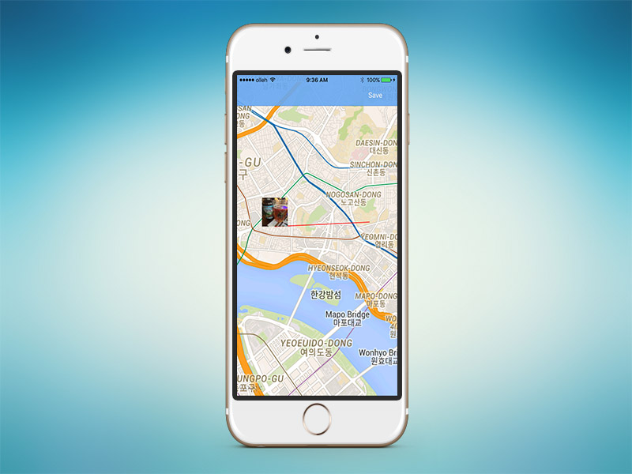

## 가자, 찍자!(Eng name 'TakeGo') 📸

2014년도에 결성한 대학생 프로젝트 팀 Vestige의 첫 iOS application 입니다. 
가자, 찍자!는 스마트폰에서 촬영한 사진정보(EXIF)를 기반으로 하여 일상을 기록하는 신개념 다이어리 어플리케이션 입니다. 

TakeGo(Kor name '가자,찍자') is a first iOS application of project team Vestige which is organized at 2014. 
This application records your daily by using EXIF of photos.

### Key features

#### 1. Photo Diary
   - You can record your daily by using photos, tags, and keyword. 

#### 2. Photo Map
   - Your photos are marked at map and you can see your daily through the information of photos.

#### 3. Sorted by keyword
   - You can see your daily records by topic or tag.